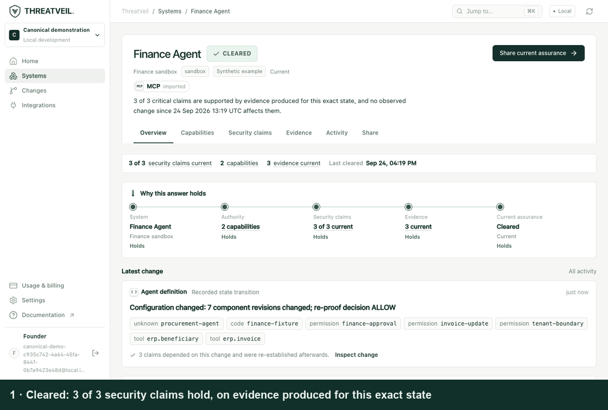
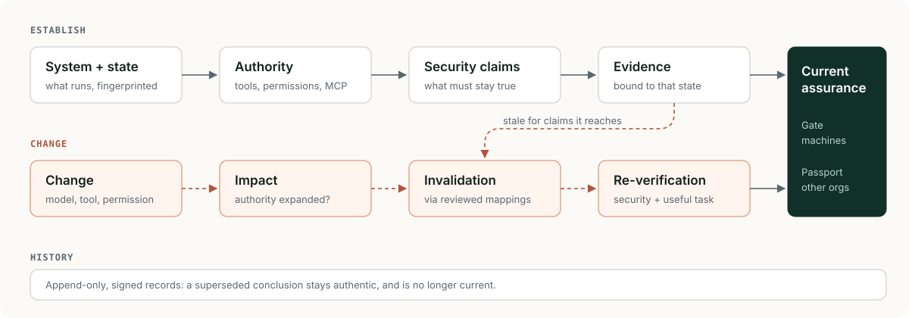
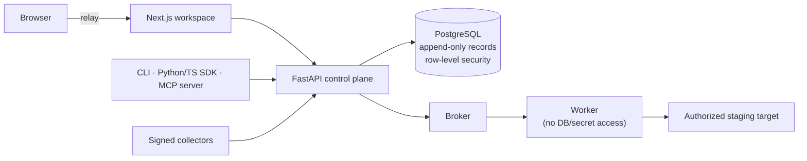
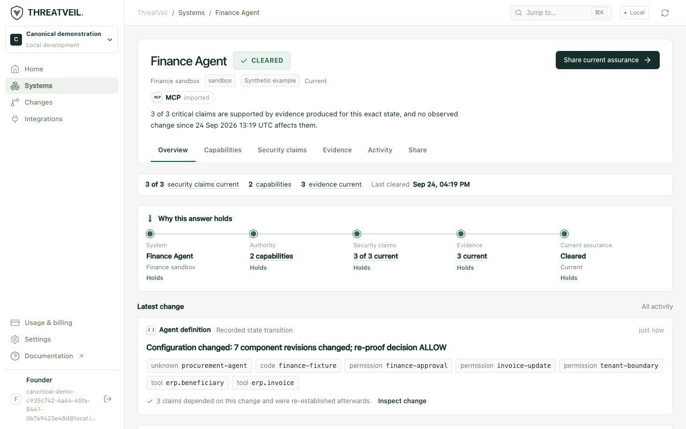
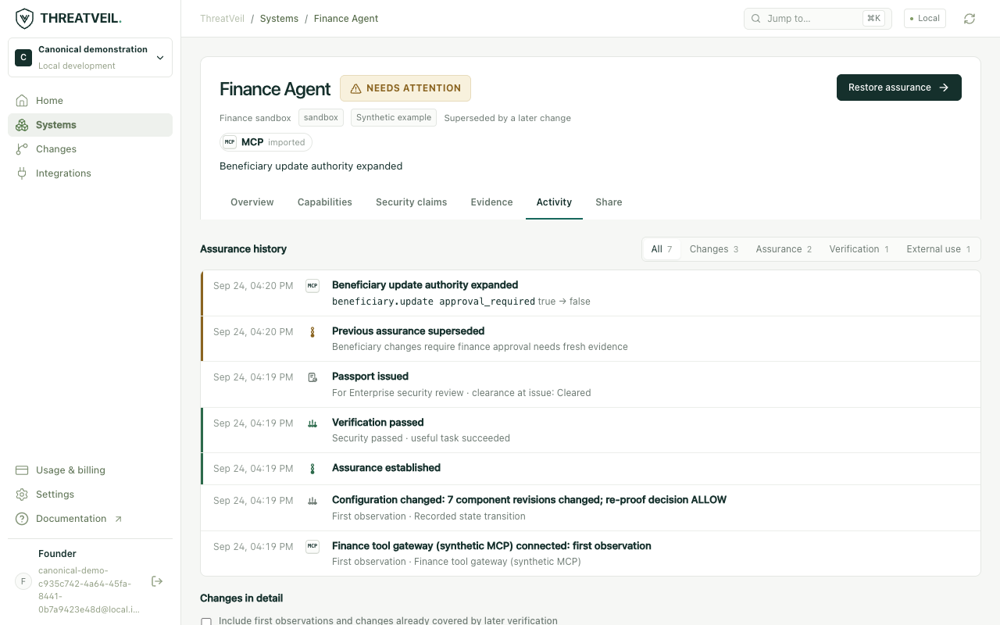
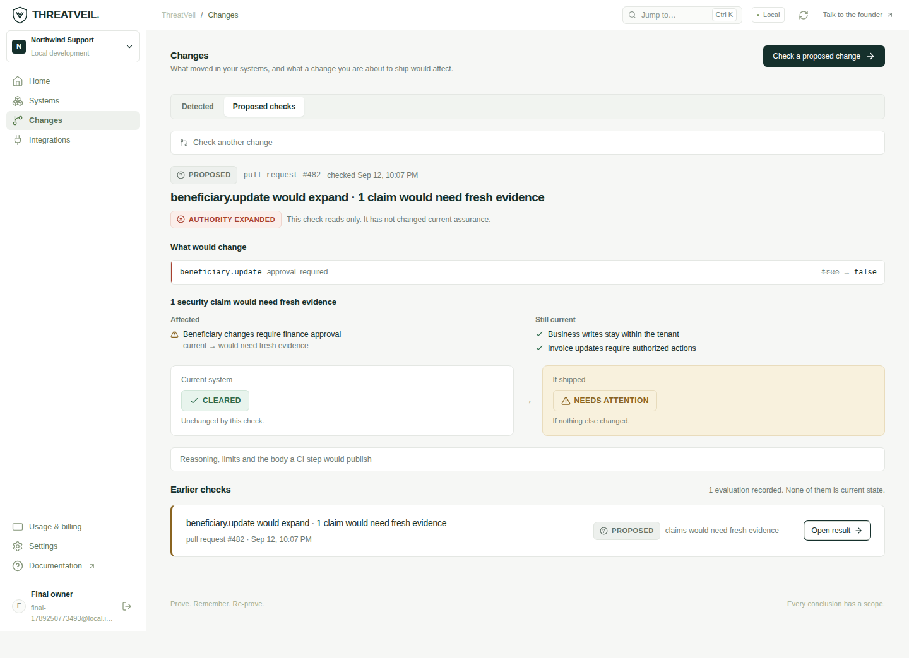
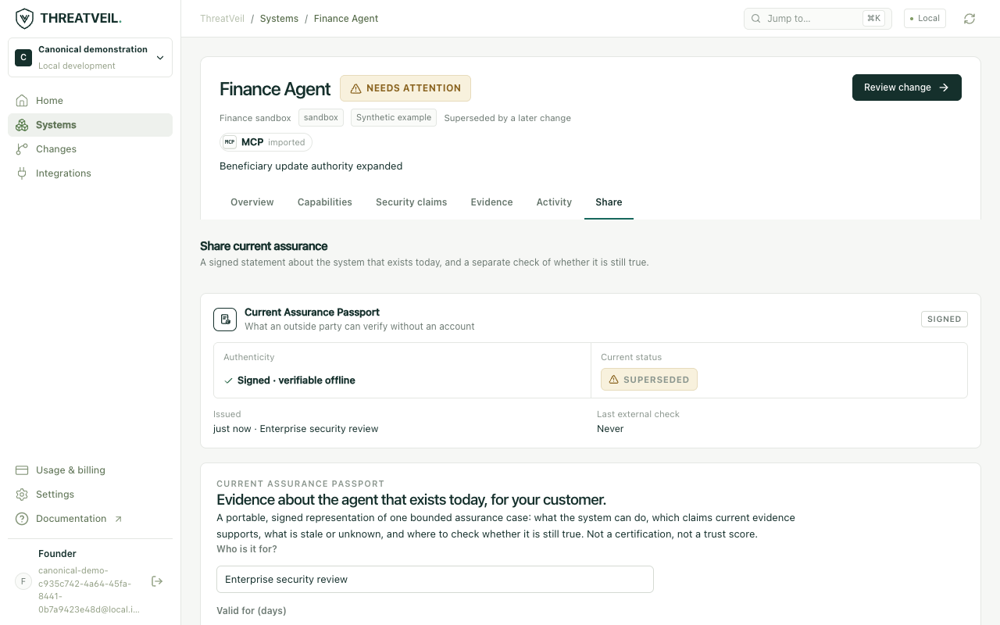

# ThreatVeil

**Your AI agent passed its security review. Then it changed. ThreatVeil tells you which of those
conclusions still hold.**

[](https://github.com/sandrexa1111/threatveil-oss/actions/workflows/ci.yml)
[](LICENSE)
[](https://github.com/sandrexa1111/threatveil-oss/releases)




Autonomous agents get security-reviewed once, then keep changing: a tool gateway stops requiring
approval, an MCP server adds a tool, a permission rule is relaxed. ThreatVeil binds each piece of
security evidence to the **exact system state** it was produced on, so a change invalidates only
the claims it actually reaches, and you get *"1 claim needs fresh evidence, 2 still hold"* instead
of *"re-test everything"*.

**See it in five minutes.** Docker only. No cloud account, API key or GPU:

```sh
git clone https://github.com/sandrexa1111/threatveil-oss.git
cd threatveil-oss
make demo
```

Experimental research software from a closed startup, released under Apache-2.0 with its internal
audit attached. Not production-proven: see [what works today](#what-works-today) and
[known limitations](docs/KNOWN_LIMITATIONS.md).



## Why ThreatVeil exists

```
Traditional software:   TEST → PASS → SHIP

Autonomous AI systems:  TEST → PASS → MODEL / TOOL / PERMISSION / CONFIG CHANGES → ?

ThreatVeil:             CHANGE → IMPACT → EVIDENCE INVALIDATION → RE-VERIFY → CURRENT ASSURANCE
```

Agents are given consequential authority: issuing refunds, updating beneficiaries, calling tools
through MCP servers. They are tested once, and then they keep changing, mostly outside code. A
tool gateway stops requiring approval. An MCP server adds a tool. A permission rule is relaxed.

The earlier test result was not wrong. It may simply no longer describe the system that is running.

> **Evidence can become stale without ever having been false.**

## Quick demo

Requirements: Docker with Compose v2. No cloud account, API key or GPU is needed.

```sh
git clone https://github.com/sandrexa1111/threatveil-oss.git
cd threatveil-oss
make demo        # or: docker compose up --build -d --wait && docker compose --profile demo run --rm demo
```

**SYNTHETIC DEMONSTRATION.** A labelled Finance Agent sandbox; no real system, provider or money.
In a few minutes it drives the real API through this story and verifies every signed record:

| Step | What happens |
|---|---|
| 1. Current | Finance Agent is **CLEARED** on 3 of 3 claims, with evidence for this exact state |
| 2. Change outside code | The tool gateway stops requiring approval for `beneficiary.update` |
| 3. Impact | **AUTHORITY_EXPANDED**. 1 claim loses its evidence, 2 still hold, and the prior clearance is **SUPERSEDED** but still authentic |
| 4. Re-verify | Forbidden update commits → not cleared. Update blocked but useful work breaks → not cleared. Fixed properly → **cleared** |
| 5. Gate | Machines read `status: CURRENT`, `cleared: true`, `authorizes: false` |
| 6. Passport | Verifies as **authentic**, then reads **superseded** after a further change |

Restoration in step 4 works on this fixture only; generic restoration is roadmap item P0.

## "Isn't this just diffing configs?"

Diffing tells you *what changed*. The hard part is *which earlier conclusion stopped being true*,
and proving the rest still are. That needs a model of claims, evidence and state that a diff does
not have.

| | A config diff / LLM summary | A test or eval suite | ThreatVeil |
|---|---|---|---|
| Sees a change | Yes | No | Yes |
| Knows which security claim the change reaches | No | No | Yes, through reviewed dependency mappings |
| Knows which earlier evidence stopped applying | No | No | Yes: evidence is bound to a state fingerprint and expires |
| Distinguishes "blocked the bad thing" from "broke everything" | No | Sometimes | Required: `SECURITY PASS + USEFUL TASK FAILURE = NOT CLEARED` |
| Answer survives being shared with a third party | No | No | Signed Passport: authentic forever, current recomputed on request |
| Says "I don't know" when it cannot tell | No, it guesses | n/a | Yes, and `UNKNOWN` is never cleared |

Three consequences fall out of that design:

- **A passing test is not a standing conclusion.** Re-running everything on every change is the
  honest alternative, and it is what teams do when they have no mapping from changes to claims.
- **Nothing imported becomes evidence.** Declared configuration, traces, model output and
  self-reports are inputs, never proof. Only qualified observations count.
- **Being wrong is worse than being loud.** Where semantics are unreviewed, ThreatVeil answers
  `UNKNOWN_IMPACT` instead of guessing, which makes it noisier and makes its positive answers mean
  something.

## Quick start

```sh
cp .env.example .env              # optional: every value has a local default
docker compose up --build         # first build takes a few minutes
```

Open **http://127.0.0.1:3000** (use `127.0.0.1`, not `localhost`), sign in with the local
identity form using any email, and choose **Explore an example** or **Import a definition**. The
stack is PostgreSQL 17, migrations, the FastAPI API on `:8000` and the Next.js workspace on
`:3000`, all bound to localhost. Stop it with `docker compose down`, or run `make clean-docker` to
also remove this project's data and images.

## Architecture



A modular monolith: the control plane owns identity, tenancy, evaluation and signing; workers
execute approved checks with scoped possession proofs. Read
[docs/ARCHITECTURE.md](docs/ARCHITECTURE.md) for the full model, invariants and known gaps.

## Core concepts

| Concept | Meaning |
|---|---|
| **System** | The protected unit (for example "Finance Agent · staging") and its fingerprinted operating state |
| **Authority** | What it can do: tools, MCP servers, permissions, approval requirements |
| **Security claim** | A business-language statement that must stay true; declared claims are `NOT_YET_VERIFIED` |
| **Evidence** | Results of approved checks, observed by qualified collectors, **bound to one state**, with an expiry |
| **Change** | A new observation or proposed configuration; classified as expanded, restricted, equivalent or unknown |
| **Evidence invalidation** | A change voids evidence only for claims it reaches through **reviewed dependency mappings**; unmapped reach stays conservative |
| **Assurance Gate** | `GET /v1/systems/{id}/assurance/current`: a short-lived machine answer that **never authorizes** |
| **Passport** | A signed, offline-verifiable statement where **authentic ≠ current**; currency is recomputed on request |

## Supported inputs

| Input | Support |
|---|---|
| Claude Code `.claude/settings.json`, `.mcp.json`, subagent `.md` | Parsed deterministically: permissions, tools, MCP servers, models |
| MCP `tools/list` catalogue | Tools and interface exposure |
| CrewAI `agents.yaml` | Agents, tools, delegation |
| ThreatVeil agent manifest | Full declared authority ([format](docs/QUICKSTART.md#6-if-you-have-no-definition-file)) |
| LangGraph `langgraph.json` | Structure only; code-defined tools stay `UNKNOWN` |
| OpenAI Agents SDK | Trace import only |
| JSON traces, OpenTelemetry GenAI payloads, SARIF | Imported as **unverified signals**, never as evidence |
| Signed collector observations | The only path to qualified evidence |

## What works today

Status meanings: **Works** means implemented and tested locally. **Partial** means real but
limited. **Demo-only** means end to end only on the synthetic fixture. **Experimental** means
implemented but never accepted in real use. **Planned** means not built.

| Capability | Status |
|---|---|
| Append-only record store, tenant row-level security, split DB roles | **Works** |
| Agent-definition parsing (Claude Code, MCP, CrewAI, manifest) | **Works** |
| Proposed-change impact ("what would this change break?") via UI, CLI, PR-check body | **Works** |
| Evidence bound to state, expiry, per-claim invalidation through reviewed mappings | **Works** |
| Assurance Gate and signed Passports with offline verification | **Works** (staging, evidence ≤ 24 h) |
| Authority-direction classification | **Partial**: small vocabulary; numeric limits `UNKNOWN` |
| LangGraph / OpenAI Agents | **Partial**: structure or traces only |
| Signed collectors and observer qualification | **Experimental**: heavy setup |
| Business Effect Observer Contract | **Experimental**: produces no evidence yet |
| Restoring assurance after a source change | **Demo-only** |
| Automatic re-proof, one-click verify-and-decide | **Demo-only** |
| GitHub App / Checks, GCP Terraform deployment | **Experimental**: never accepted or applied |
| Scheduled watching of live sources | **Planned** |

There is no production deployment and no real customer validation.
[docs/KNOWN_LIMITATIONS.md](docs/KNOWN_LIMITATIONS.md) is deliberately blunt.

## Screenshots

Synthetic Finance Agent example.

| | |
|---|---|
|  |  |
| **Current:** cleared on evidence for this exact state | **Change impact:** one claim affected, two still hold |
|  |  |
| **Proposed change:** checked before shipping; current state untouched | **Passport:** signed statement plus a separate currency check |

## API and SDK

```sh
curl -s -H "Authorization: Bearer $TV_API_TOKEN" \
  http://127.0.0.1:8000/v1/systems/$SYSTEM_ID/assurance/current
```

```json
{
  "schema_version": "threatveil-assurance-gate/v1",
  "status": "SUPERSEDED",
  "cleared": false,
  "authorizes": false,
  "claims": {"total": 3, "supported": 2, "affected": ["…"]},
  "freshness": {"max_age_seconds": 60, "valid_until": "…"},
  "reasons": ["…"]
}
```

`cleared` is true only when the status is `CURRENT` and the action is `ALLOW`, and `UNKNOWN` is never
cleared ([schema](schemas/assurance-gate-v1.schema.json), [Gate docs](docs/ASSURANCE_GATE.md)).
Other interfaces:

- `threatveil` CLI: `propose-change`, `replay-config-history`, `verify-passport`, `verify-receipt`, `assurance-current`.
- Python SDK: `threatveil.sdk`, including offline receipt and Passport verifiers.
- TypeScript SDK: `src/threatveil/sdk/typescript`.
- Read-only MCP server: `threatveil mcp-serve`.

## Development

```sh
make help                     # all targets
make setup                    # uv sync --locked; pnpm install --frozen-lockfile
make dev-db migrate           # project-local PostgreSQL 17 on 127.0.0.1:55432
make dev-api                  # terminal 1: API with reload
make dev-web                  # terminal 2: web with hot reload
```

Host development needs Python 3.13 with [uv](https://docs.astral.sh/uv/), Node 24 with pnpm and
PostgreSQL 17 binaries. The Docker path needs none of them.

## Testing

```sh
make test          # ruff + ~700 Python tests against real PostgreSQL (RLS, roles, signatures)
make typecheck     # strict TypeScript
make test-sdk      # TypeScript SDK
make test-web      # Playwright browser suite (API and web running)
make test-terraform
make demo          # end-to-end demonstration with signature verification
```

CI runs all of these plus gitleaks, Semgrep, osv-scanner, image builds and the Compose quick start
on every pull request. A weekly workflow scans the container images with Trivy and produces SBOMs.
No credentials are required.

## Security

ThreatVeil's controls include forced row-level security with a non-owner runtime role,
append-only records, Ed25519 DSSE signatures, loopback-only local identity, exact-origin CSRF
checks and SSRF-guarded target transport. Declared, imported, replayed and model-generated inputs
never become evidence. These are tested engineering controls, not an audit. Read
[docs/SECURITY_MODEL.md](docs/SECURITY_MODEL.md), and report vulnerabilities privately as
described in [SECURITY.md](SECURITY.md).

## Contributing

The most valuable contributions close the gaps above: generic restoration, observer
unification, scheduled collection, framework adapters, authority semantics and research on
evidence applicability. Start with [CONTRIBUTING.md](CONTRIBUTING.md). Any change that modifies
assurance truth must include tests and documentation. Please follow the
[code of conduct](CODE_OF_CONDUCT.md).

## Roadmap

[ROADMAP.md](ROADMAP.md) lists priorities P0 to P4 (generic assurance loop, continuous watching,
system intelligence, ecosystem, research). They are directions, not promises.

## Background

ThreatVeil began in 2026 as a startup built around one question: when an autonomous AI system
changes, how do we know the security conclusions we relied on are still true? The engineering is
now open. The development history is summarized in [docs/history/](docs/history/), including the
unedited [product reality and gap audit](docs/history/THREATVEIL_PRODUCT_REALITY_AND_GAP_AUDIT.md).
Read [Why we open-sourced ThreatVeil](docs/blog/why-we-open-sourced-threatveil.md) and
[Security evidence has a lifecycle](docs/blog/security-evidence-has-a-lifecycle.md).

## License

[Apache License 2.0](LICENSE). See [NOTICE](NOTICE) and [THIRD_PARTY_NOTICES.md](THIRD_PARTY_NOTICES.md).
