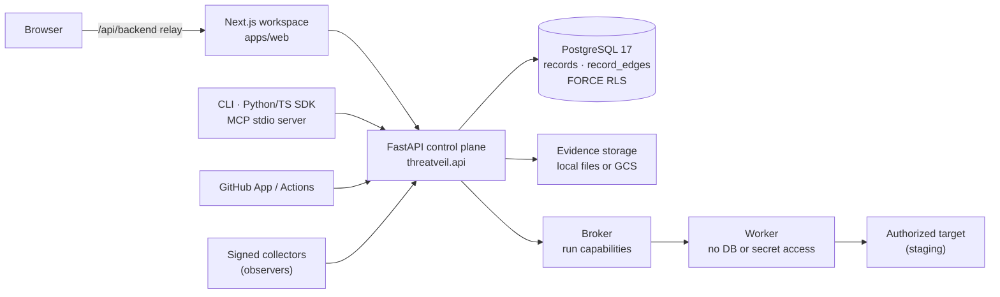

# Architecture

ThreatVeil is a modular monolith: a FastAPI control plane, a Next.js workspace, PostgreSQL as
append-only security memory, and a separately deployable execution broker and worker. This
document explains the assurance model first, then where it lives in code, how it runs, and
where the architecture is known to be incomplete.

For the unvarnished status of each part, read [KNOWN_LIMITATIONS.md](KNOWN_LIMITATIONS.md)
alongside this file.

## Components



- **Web** (`apps/web`) is a Next.js app. A narrow relay route
  (`src/app/api/backend/[...path]/route.ts`) forwards an allowlist of headers to the API.
- **API** (`src/threatveil/api.py` plus routers such as `assurance_api.py`,
  `change_assurance_api.py`, `connector_api.py`, `trust.py`) owns identity, tenancy, records,
  evaluation and signing.
- **Broker, launcher and worker** (`broker.py`, `launcher.py`, `worker.py`) execute approved
  checks. Workers authenticate with identity *and* a scoped possession proof, and hold no
  database, storage or secret-manager credentials.
- **MCP server** (`threatveil mcp-serve`) is read-only and reaches the API over HTTP; it has
  no database access.

## The assurance model

```
System → Authority → Security claims → Evidence → Change → Evidence invalidation
       → Re-verification → Current assurance → Gate / Passport
```

| Stage | Meaning | Main code |
|---|---|---|
| **System** | The protected unit: an organization's system, its environments (for example staging) and its operating state | `change_assurance.py` (environments, permission envelopes, operating states) |
| **Authority** | What the system can do: tools, MCP servers, permissions, approval requirements | `agent_definitions.py`, `adapters/mcp.py`, `integrations/mcp_discovery.py`, `connector_api.py`, `connectors/` |
| **Security claims** | Business-language statements, backed by executable properties when verified | `claim_builder.py`, `core/templates.py`, `release_integrity.py` (properties) |
| **Evidence** | Results of approved checks, observed by qualified signed collectors and bound to an exact state fingerprint | `captures.py`, `execution.py`, `observers.py`, `release_integrity.py` (ProofScope, applicability), `core/validity.py`, `evidence_storage.py` |
| **Change** | A new source assertion or change event, or a proposed change that does not alter current state | `connector_api.py`, `source_semantics.py` (what changed and which way authority moved), `proposed_changes.py` |
| **Evidence invalidation** | A change voids evidence for the claims it reaches through reviewed dependency mappings; unmapped reach stays conservative | `dependency_mapping.py`, `release_integrity.py`, `change_assurance.py` |
| **Re-verification** | Re-running approved checks on the new state; automatic re-proof repeats only an already-approved verification | `release_integrity.py` (re-proof plans), `auto_reproof.py`, `assurance_intelligence.py` (restore plan) |
| **Current assurance** | Clearance recomputed from append-only records for the current state | `change_assurance.py`, `assurance_intelligence.py` |
| **Gate / Passport** | Machine answer and signed external statement | `assurance_api.py` (`GET /v1/systems/{id}/assurance/current`), `passports.py`, `trust.py` (`/v1/trust/keys`), `sdk/passports.py`, `sdk/receipts.py`, `sdk/change_records.py` |

### Invariants

These are enforced in code and covered by tests. Changing any of them falls under the
[assurance-semantics rule](../CONTRIBUTING.md#the-assurance-semantics-rule).

- Declared, imported, replayed, synthetic and model-generated inputs never become evidence on
  their own. `DECLARED` and `NOT_YET_VERIFIED` claims never enter the Gate.
- Evidence applies only to the state it was produced on, and expires.
- `SECURITY PASS + USEFUL TASK FAILURE = NOT CLEARED`.
- A historical signed decision stays authentic after it stops being current. Authenticity and
  currency are separate facts.
- The Gate reports; it does not authorize (`authorizes: false`). Enforcement belongs to the
  consumer.
- Uncertain scope blocks positive reuse. Unknown stays unknown.

## Semantics in detail

### The full chain

```
SYSTEM → STATE → AUTHORITY → CLAIM → EVIDENCE → CHANGE → INVALIDATION
       → RE-VERIFICATION → ASSURANCE → CONSUMPTION (Gate, Passport) → HISTORY
```

### Append-only history

Every fact is an immutable record: an observation, a mapping, a decision, a Passport issuance or
a revocation. Clearance is never stored as a mutable flag. It is recomputed from records for the
current state, so "what was known, when, about which state" can always be reconstructed. A later
change never edits an earlier conclusion; it supersedes it.

### Signed records and the trust directory

Release receipts, change records and Passports are Ed25519 DSSE envelopes with in-toto-style
statements (`sdk/receipts.py`, `sdk/change_records.py`, `sdk/passports.py`). The published trust
directory (`GET /v1/trust/keys`, `trust.py`) lists issuer keys with validity windows. Verifiers
must obtain the trusted key independently; an envelope's embedded key is informational. Locally,
the key is labelled `LOCAL_DEMONSTRATION` and is not a trust root.

### Gate semantics

`GET /v1/systems/{id}/assurance/current` ([schema](../schemas/assurance-gate-v1.schema.json)):

- `status` is one of `CURRENT`, `EXPIRED`, `SUPERSEDED`, `REASSESS`, `REVOKED` or `UNKNOWN`.
- `cleared` is true only when `status` is `CURRENT` **and** the action is `ALLOW`. `UNKNOWN` is
  never cleared.
- `authorizes` is always `false`. The Gate is an input to a consumer's policy, never a grant.
- `freshness.max_age_seconds` is at most 60, so a consumer must not cache a clearance.
- `reasons` and `claims.affected` explain a non-cleared answer.

### Passport: authenticity versus currency

A Passport carries two independent facts. **Authenticity** is the signature, verifiable offline
and permanent. **Currency** is whether it still describes the system now, recomputed on request
through its status URI. After a relevant change, a Passport remains authentic and reports
`SUPERSEDED`. Share links are bearer capabilities that can be revoked.

### Useful-task verification

An executable property defines a forbidden outcome, a permitted outcome, the observation that
decides between them, and a legitimate task that must keep working. A run that blocks the
forbidden outcome but breaks the legitimate task is `SECURITY PASS + USEFUL TASK FAILURE`, which
is **not cleared**. A fix that disables the system cannot restore assurance.

### Observer model

Evidence requires an observation the agent cannot forge. Today that means signed collectors
(`observers.py`): two Ed25519 keys (observer and independent ground truth), an authorized HTTPS
target with a challenge file, qualification runs with permitted, prohibited and missing-observation
controls, repeated trials, and a signed fingerprint covering every claim dependency. A missing
witness yields `INCONCLUSIVE`, never a pass. The newer Business Effect Observer Contract
(`observer_platform.py`) declares what an observer must see, but does not yet produce evidence
(gap 2 below).

### Conservative UNKNOWN

When ThreatVeil lacks reviewed semantics, it says so. Unclassified authority fields become
`UNKNOWN_IMPACT`. Unmapped changes reach every claim they could affect. Uncertain scope blocks
positive reuse. Fields in agent definitions without reviewed meaning are counted, not
interpreted. The Gate answers `UNKNOWN` rather than guessing. This makes the product noisier, and
it is the reason its positive answers mean something.

## Declared change impact vs verified current assurance

The chain above is implemented by two layers that share the record store but differ sharply in
maturity.

| | Declared change impact | Verified current assurance |
|---|---|---|
| Answers | "What would this change reach?" | "Is this system still cleared to act?" |
| Inputs | Definition or catalogue imports, declared claims, reviewed mappings | Executable properties, authorized targets, signed collectors, runs |
| Output | Claim-level impact, labelled `PROPOSED · NON-ACTIVE · NOT CURRENT STATE` for proposals | Evidence records, signed decisions, Gate, Passport |
| Changes current clearance | Never | Yes |
| Works on a real system | Yes, self-serve | Baseline with custom engineering; restoration after a source change only on the synthetic fixture |

Keeping these distinct is deliberate. A declared impact analysis can be useful immediately,
but it proves nothing about the running system. The product must never let the first be
mistaken for the second. See [DECLARED_CHANGE_IMPACT.md](DECLARED_CHANGE_IMPACT.md) and
[EVIDENCE_SEMANTICS.md](EVIDENCE_SEMANTICS.md).

## Data and tenancy

- **Security memory** is append-only: immutable `records` with typed `record_edges`. They hold
  properties, runs, captures, ProofScopes, evidence, change sets, proof plans, release
  decisions, exceptions, receipts, source assertions, mappings and Passports.
- **Operational tables** hold mutable leases, routing, quotas, delivery outbox, sessions and
  membership.
- **Tenancy:** PostgreSQL `FORCE ROW LEVEL SECURITY`. The API connects as `threatveil_app`
  (non-owner, `NOSUPERUSER`, `NOBYPASSRLS`); migrations run as `threatveil_admin`. The same
  role model is used locally (`scripts/local_db.sh`, `compose.yaml`), in CI and in the GCP
  design.
- **Locking:** system advisory locks precede artifact locks, run state, leases and account
  locks. Capture finalization and release authorization share the system serialization
  boundary.

## Identity and trust

- **Users:** local identity (only in `local`/`test`, only from loopback peers) or Firebase
  identity for a hosted deployment. Sessions use HttpOnly cookies, CSRF tokens and an exact
  web-origin check.
- **Machines:** scoped `tvk_` API tokens; separate expiring `tvrel_` release authority; broker
  service identity with worker possession proofs, fenced leases and nonces.
- **Signing:** Ed25519 DSSE/in-toto envelopes for receipts, change records and Passports.
  Locally a `LOCAL_DEMONSTRATION` key is created under `.local/receipt-signing/`; outside
  local/test an operator key is mandatory. The published trust directory
  (`/v1/trust/keys`) is derived from the active key unless an operator history is provisioned.
  Verifiers require a separately obtained public key; an envelope's embedded key is
  informational.

## Runtime topologies

**Docker Compose (local).** `postgres` → `db-init` (roles) → `migrate` → `api`. The `web`
container shares the API container's network namespace, so the relay reaches the API over
loopback and local sign-in keeps its loopback-only check. The optional `demo` service joins
the same namespace and reads the signing key from the API's state volume. All published ports
bind to 127.0.0.1.

**Host development.** Project-local PostgreSQL on 127.0.0.1:55432 (`scripts/local_db.sh`),
`uvicorn` on :8000 and `next dev` on :3000.

**Google Cloud (design only).** Terraform in `infra/` defines Cloud Run services for the API,
web, broker and launcher, a runner job, a migration job, Secret Manager, GCS evidence storage
and Cloud Scheduler. `.github/workflows/gcp-dev.yml` builds, scans and deploys. None of it was
ever applied. See [deployment/GCP.md](deployment/GCP.md).

## Known architectural gaps

Established by the
[product reality and gap audit](history/THREATVEIL_PRODUCT_REALITY_AND_GAP_AUDIT.md); IDs match
[ROADMAP.md](../ROADMAP.md).

1. **Restoration is not generic (G1).** Source-change reconciliation requires exact observed
   digests; only `finance-v1` is discharged without them.
2. **Two observer concepts (G2).** The Business Effect Observer Contract (`observer_platform.py`)
   yields no evidence. Evidence comes only from the older signed collector path
   (`observers.py`).
3. **No scheduler (G3).** Connector collection happens only on request, and stale non-imported
   sources unsupport every claim.
4. **No generic verify-and-decide orchestration (G7).** Only the fixture composes run → plan →
   release → state → decision.
5. **Staging-only state provenance (G15).** `PRODUCTION` environments cannot obtain qualified
   state provenance, and evidence lives at most 24 hours.
6. **Two invalidation paths.** Release-integrity ProofScope applicability and change-assurance
   projections coexist; they agree on the audited scenarios but are not one engine.
7. **Projection truth defects (G4).** Some workspace projections (Home filing, "covered by later
   verification", Passport issuance with zero evidence) are more optimistic than the Gate.
8. **Legacy surfaces (G26).** Release-integrity-era surfaces (gauntlets, fixes, findings, release
   machine) remain in the product beside the newer change-assurance path.

## Implementation notes

Preserved from the development-era version of this document.

The category foundation adds explicit environments, permission envelopes, operating states, source assertions/change events, assurance-case snapshots, scoped authorization and separate enforcement acknowledgement on the same immutable kernel. A centralized commercial domain pins plan versions and controls capacity without importing security evaluation. See [domain and migration specification](CHANGE_ASSURANCE.md), [connector contracts](CONNECTOR_CONTRACT.md), and [commercial platform](COMMERCIAL_PLATFORM.md).

Release evaluation loads all active approved properties. It compares the requested fingerprint to qualified observed evidence, checks applicability, budgets, adverse history, target/observer authorization and exceptions, then persists the exact decision and signed DSSE receipt in one transaction. GitHub check delivery is a durable outbox projection. Current applicability is reevaluated separately from the historical signed decision.

Intake adapters normalize declared telemetry, tool catalogs and composition reports. They cannot mint qualified observations. Migrations 0006 and 0007 add release-history indexes and a narrowly scoped migration-role deletion exception.

The control plane may access credentials and raw evidence storage; the cloud worker receives narrow run-scoped broker access. GCP topology and identity assumptions are in [GCP_DEPLOYMENT.md](GCP_DEPLOYMENT.md). Live IAM and failure recovery have not been accepted in GCP.
